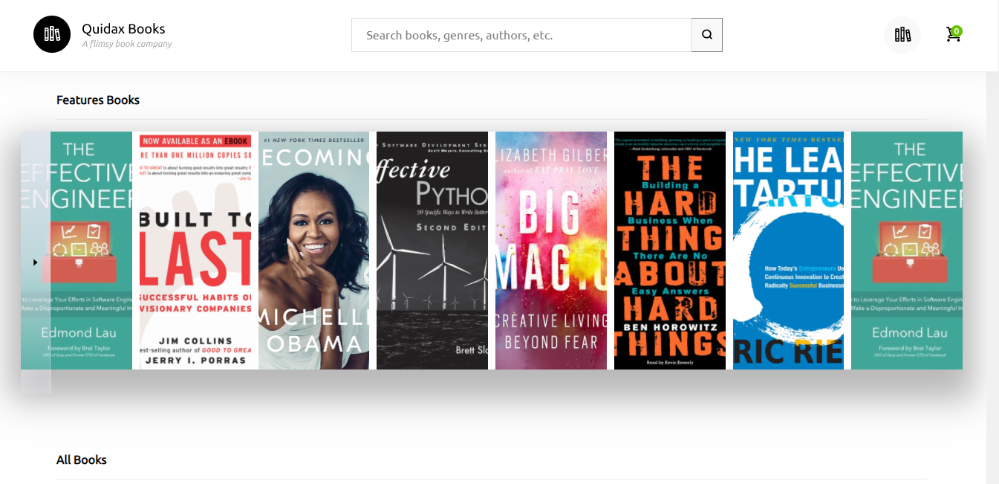

# QUIDAX BOOK

### Screenshot

## To run the app and install all dependencies

In the project directory, you can run:

### `npm install`

### `npm start`

Runs the app in the development mode.\
Open [http://localhost:3000](http://localhost:3000) to view it in the browser.

The page will reload if you make edits.\
You will also see any lint errors in the console.

### `npm build`

Builds the app for production to the `build` folder.\
It correctly bundles React in production mode and optimizes the build for the best performance.

The build is minified and the filenames include the hashes.\
Your app is ready to be deployed!

### Links

- Live Site URL: [Nelitfy](https://quidax-sheifunmi.netlify.app/)

### Built with

- Semantic HTML5 markup
- React JS
- CSS Grid
- Apollo Client Library
- GraphQL

## Issues faced while completing the assignment

1. looking for Quidax Api was difficult.
2. This is my first project accessing a graphql endpoint using Apollo client.
